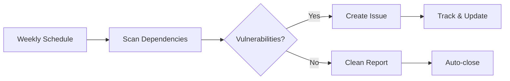

# Getting Started with the Security Recipe

Welcome to the **Python Security Audit Recipe**! This guide provides an overview of automated security scanning and helps you understand what this recipe will do for your Python project.

## What You'll Achieve

The Python Security Audit Recipe transforms your repository into a security-first codebase by providing:

- ✅ **Automated security scanning** running weekly on schedule
- ✅ **Intelligent GitHub issues** automatically created for vulnerabilities  
- ✅ **Rich audit reports** in JSON, Markdown, and text formats
- ✅ **Zero-maintenance security** that works automatically in the background

## How It Works

The recipe works through three main components:

1. **📋 GitHub Actions Workflow** - Runs pip-audit scans automatically
2. **🎫 Issue Templates** - Creates structured vulnerability reports  
3. **🔍 Automated Management** - Updates and closes issues as vulnerabilities are resolved

### The Process

## Prerequisites

Before starting, ensure you have:

- ✅ **GitHub repository** with a Python project
- ✅ **`requirements.txt` file** in your repository root
- ✅ **GitHub Actions enabled** in your repository
- ✅ **Repository write access** to create workflows and issues

---

???+ note "Documentation Progress Checklist"

    Track your progress through the Python Security Audit Recipe documentation:

    - [x] **Home** - Understanding the security challenge
    - [x] **Getting Started** - Quick overview and concepts
    - [ ] **Installation** - Set up your environment
    - [ ] **Workflow Details** - Understand GitHub Actions mechanics
    - [ ] **Issue Templates** - Master security notification management
    - [ ] **Configuration** - Customize for your project needs
    - [ ] **Examples** - Real-world implementations

### Next Up: [Installation Guide](installation.md)

**Ready to get started?** Continue to the **[Installation Guide](installation.md)** to set up automated security scanning in just 30 seconds!
