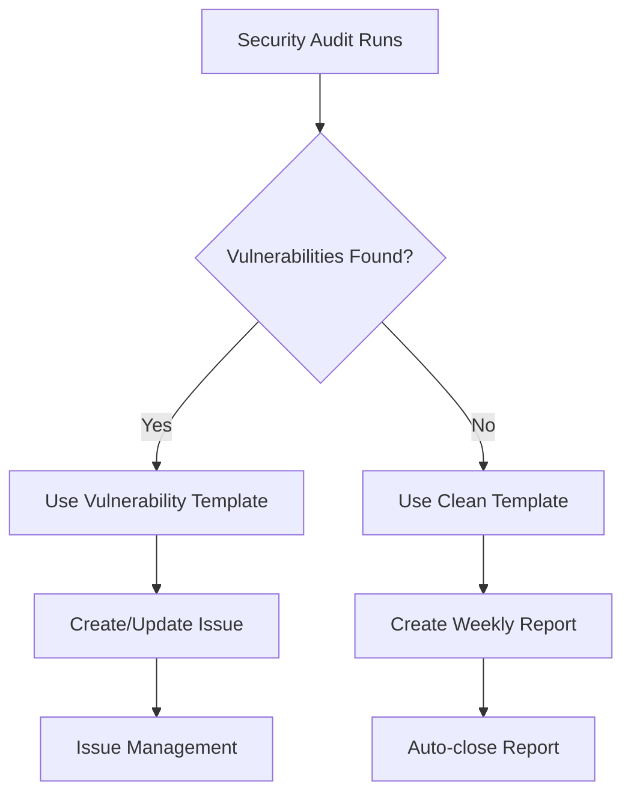

# Issue Templates

The security audit recipe uses GitHub issue templates to automatically create structured reports when vulnerabilities are found or when clean audits are completed.

## Template Overview

The recipe includes two issue templates:

1. **Security Vulnerability Report** - Created when vulnerabilities are detected
2. **Clean Security Audit Report** - Created for weekly clean audit summaries

## Security Vulnerability Template

This template is used when the workflow detects vulnerabilities in your dependencies.

??? ".github/ISSUE_TEMPLATE/security-vulnerability-report.md"

    **File**: `.github/ISSUE_TEMPLATE/security-vulnerability-report.md`

    ```markdown
    ---
    name: Security Vulnerability Report
    about: Automated security vulnerability report from pip-audit
    title: "🚨 Security Audit: Vulnerabilities found in dependencies"
    labels: ["security", "pip-audit", "vulnerability", "dependencies"]
    assignees: []
    ---

    ## 🔍 Security Audit Summary

    **Scan Date:** <!-- Date will be filled by workflow -->
    **Repository:** <!-- Repository will be filled by workflow -->
    **Branch:** <!-- Branch will be filled by workflow -->
    **Commit:** <!-- Commit will be filled by workflow -->

    **Vulnerabilities Found:** <!-- Count will be filled by workflow -->
    **Affected Packages:** <!-- Count will be filled by workflow -->

    ## 🚨 Vulnerability Details

    <!-- Vulnerability details will be filled by workflow -->

    ## 📋 Recommendations

    1. Review each vulnerability listed above
    2. Update affected packages to the recommended fix versions
    3. Test the application after updates
    4. Consider using `pip-audit --fix` for automatic updates (with caution)

    ## 🔧 Manual Fix Commands

    ```bash
    # Review the vulnerabilities
    pip-audit -r requirements.txt

    # Attempt automatic fixes (use with caution)
    pip-audit -r requirements.txt --fix
    ```

## Clean Audit Template

This template is used for weekly reports when no vulnerabilities are found.

??? info ".github/ISSUE_TEMPLATE/clean-security-audit-report.md"

    **File**: `.github/ISSUE_TEMPLATE/clean-security-audit-report.md`

    ```markdown
    ---
    name: Clean Security Audit Report
    about: Report for when no vulnerabilities are found
    title: "✅ Security Audit: No vulnerabilities found"
    labels: ["security", "pip-audit", "clean"]
    assignees: []
    ---

    ## ✅ Clean Security Audit

    No vulnerabilities were found in the dependency scan.

    **Scan Date:** <!-- Date will be filled by workflow -->
    **Repository:** <!-- Repository will be filled by workflow -->
    **Dependencies Scanned:** <!-- Count will be filled by workflow -->

    All dependencies appear to be secure based on the current vulnerability databases.
    ```

## Installing Templates

???+ tip "Template Installation Options"

    Choose your preferred method to install the GitHub issue templates for automated
    security reporting in your repository.

    === "Option 1: Automatic Installation"

        The templates are automatically installed when you use the one-command setup:

        ```bash
        curl -sSL https://raw.githubusercontent.com/trivedi-vatsal/pysec-recipes/main/setup.py | python3
        ```

    === "Option 2: Manual Installation"

        Download the templates manually:

        ```bash
        # Create directory
        mkdir -p .github/ISSUE_TEMPLATE

        # Download vulnerability report template
        curl -o .github/ISSUE_TEMPLATE/security-vulnerability-report.md \
          https://raw.githubusercontent.com/trivedi-vatsal/pysec-recipes/main/.github/ISSUE_TEMPLATE/security-vulnerability-report.md

        # Download clean audit template
        curl -o .github/ISSUE_TEMPLATE/clean-security-audit-report.md \
          https://raw.githubusercontent.com/trivedi-vatsal/pysec-recipes/main/.github/ISSUE_TEMPLATE/clean-security-audit-report.md
        ```

## Template Customization

!!! note "Modifying Labels"

    You can customize the labels assigned to issues by editing the template frontmatter
    to better organize and categorize your security audit issues.

    ```yaml
    # Default labels
    labels: ["security", "pip-audit", "vulnerability", "dependencies"]

    # Custom labels example
    labels: ["security", "critical", "audit", "dependencies", "team-security"]
    ```

!!! info "Adding Assignees"

    Automatically assign issues to team members to ensure proper ownership and
    accountability for security vulnerabilities.

    ```yaml
    # Assign to specific users
    assignees: ["security-team-lead", "devops-engineer"]

    # Assign to yourself
    assignees: ["@me"]
    ```

!!! tip "Custom Title Formats"

    Modify the issue title format to match your project's naming conventions
    and include relevant context information.

    ```yaml
    # Default vulnerability title
    title: "🚨 Security Audit: Vulnerabilities found in dependencies"

    # Custom title with date
    title: "🚨 Security Alert [{{ date }}]: {{ vulnerability_count }} vulnerabilities found"

    # Project-specific title
    title: "[{{ project_name }}] Security Audit: Action Required"
    ```

## Template Variables

The workflow automatically fills these variables in the issue body:

| Variable | Description | Example |
|----------|-------------|---------|
| `{{ date }}` | Scan timestamp | `2024-01-15 08:00:00 UTC` |
| `{{ repository }}` | Repository name | `my-org/my-project` |
| `{{ branch }}` | Git branch | `main` |
| `{{ commit }}` | Commit SHA | `abc123def456` |
| `{{ vulnerability_count }}` | Number of vulnerabilities | `3` |
| `{{ affected_packages }}` | Number of affected packages | `2` |

## Template Workflow Integration

### When Templates Are Used

1. **Vulnerability Detection**: Creates issue using vulnerability template
2. **Weekly Clean Reports**: Creates issue using clean template (auto-closed)
3. **Issue Updates**: Updates existing vulnerability issues with new scan results
4. **Issue Closure**: Closes resolved vulnerability issues automatically

### Template Processing Flow



---

???+ note "📚 Documentation Progress Checklist"

    Track your progress through the Python Security Audit Recipe documentation:

    - [x] **🏠 Home** - Understanding the security challenge
    - [x] **📖 Getting Started** - Quick overview and concepts  
    - [x] **⚙️ Installation** - Set up your environment
    - [x] **🔄 Workflow Details** - Understand GitHub Actions mechanics
    - [x] **📋 Issue Templates** - Master security notification management
    - [ ] **🔧 Configuration** - Customize for your project needs
    - [ ] **📚 Examples** - Real-world implementations

### **Next Up:** [Configuration](configuration.md)

**Ready to customize your security setup?** Continue to **[Configuration](configuration.md)** to learn workflow customization, schedules, and advanced pip-audit options!
